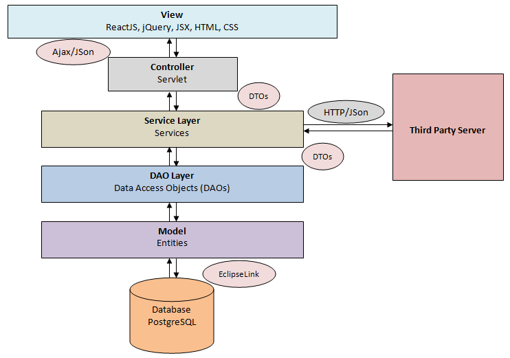
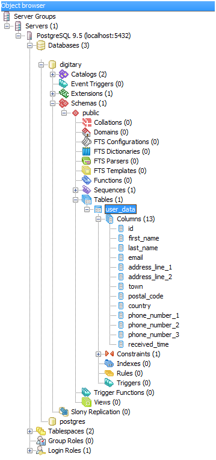
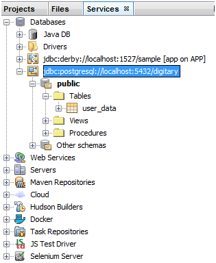
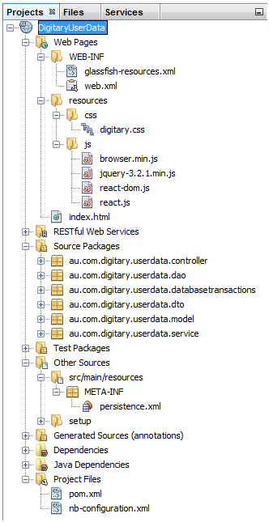
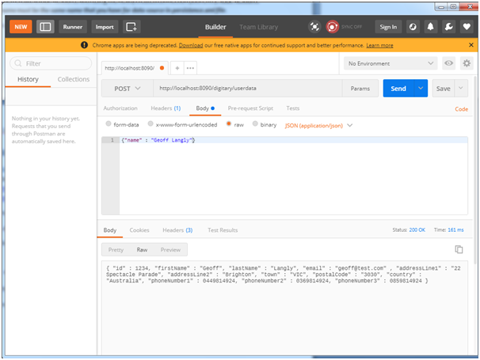
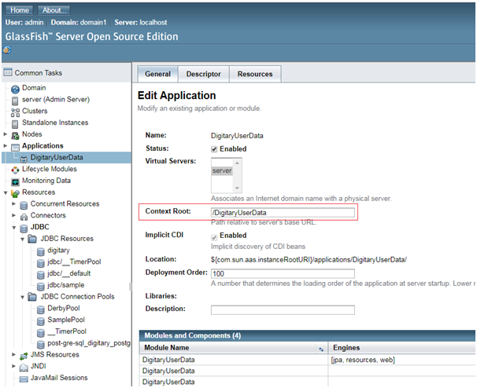
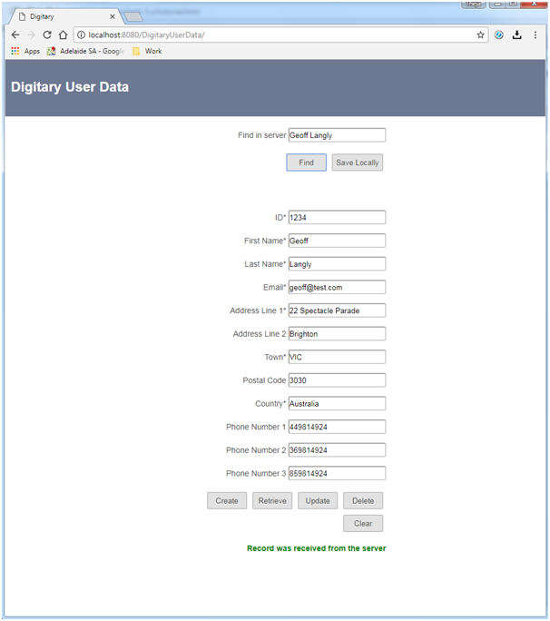

Digitary User Data Managing Application

**THEJA KOTUWELLA**

**(theja.kotuwella@gmail.com)**

Used Tools and Technologies
===========================

1.  JDK 1.8

2.  EclipseLink (JPA 2.1)

3.  NetBeans 8.2

4.  GlassFish Server 4.1.1

5.  Maven 3.1

6.  PostgreSQL 9.5

7.  WireMock 1.57

8.  Postman 5.3

9.  ReactJS 16.1, jQuery 3.2, HTML, JSX, CSS

10. Google Gson 2.8

11. Apache HttpClient 4.5

Design Decisions and Assumptions
================================

-   NetBeans IDE was selected for its easy inbuilt features that support
    rapid application development (RAD).

-   All of the tools are free for non commercial use.

-   As suggested in the assignment, used WireMock in standalone mode to
    substitute a third part server which would respond to http requests
    in JSON format.

-   Front end was developed in ReactJS, HTML, CSS, jQuery, and JSX just
    to test CRUD functionality of back-end client and test
    server request. It may not have the complete set of features due to
    the time constraints. It was built up to a state where it is just
    sufficient to carry out the core functionality. Effort was not
    utilised to move out the scripting from the html file and better
    modularising it. This should be a future enhancement.

-   To retrieve data from third party server, name of a person is used.
    This can be replaced by any other unique identification as required.
    Name just denotes the place holder for identifier.

-   In the client back-end system, the name is used as first name and
    last name. This was done as a provision for future improvements.

-   Client back-end follows Model-View-Controller (MVC) architecture. To
    maintain a clear segregation between layers, Data Access
    Object (DAO) layer and Business Service layer were not mixed up even
    though some of the business services don’t do much at this moment.
    That way, it was easier to keep the same level of abstraction in the
    methods in the 2 specific layers. Data is transferred between layers
    with using Data Transfer Objects (DTOs).

-   Singleton pattern was followed where applicable.

-   Interfaces were used for clear demarcation of responsibilities. This
    may not look hugely advantageous at this stage. But moving forward,
    this could help significantly.

-   Even though, the code is mostly self explanatory, explicit javadoc
    commenting was carried out for all public and non-public methods
    and classes.

-   For ORAM mapping with persistence, EclipseLink was used.

-   A simple Servlet acts as the front controller. web.xml configuration
    just directs 5 unique urls patterns to the Servlet. These are for
    the 5 functionalities available in the application (finding in the
    external server, and CRUD operations).

-   Google Gson was used to switch between JSON and Java objects.

-   Apache HttpClient was used to communicate in HTTP with the third
    party back-end server.

A very basic architectural diagram is elaborated below.

***Figure 1:*** Architectural overview of the application design

Database
========

A very simple database table is used to store the values in client side.

The script to create the table is found inline below.

-- Table: public.user\_data

-- DROP TABLE public.user\_data;

CREATE TABLE public.user\_data

(

id integer NOT NULL,

first\_name text NOT NULL,

last\_name text NOT NULL,

email text NOT NULL,

address\_line\_1 text NOT NULL,

address\_line\_2 text,

town text NOT NULL,

postal\_code text,

country text NOT NULL,

phone\_number\_1 integer,

phone\_number\_2 integer,

phone\_number\_3 integer,

received\_time timestamp with time zone,

CONSTRAINT user\_data\_pkey PRIMARY KEY (id)

)

WITH (

OIDS=FALSE

);

ALTER TABLE public.user\_data

OWNER TO postgres;

How it is organised in the Database and in the IDE
==================================================

Below screen capture is from PostgreSQL client PGAdmin. A new database
‘digitary’ is created with one table ‘user\_data’.

***Figure 2:*** PostgreSQL database

This is directly mapped to the IDE by connecting with the database with
using the provided drivers.

***Figure 3:*** Connected database in IDE

A screenshot of how the project resources are organised in the IDE is
elaborated below. It shows the structured architecture of the project
too.

***Figure 4:*** Project structure in IDE

Starting from the top,glassfish-resources.xml file contains the
configurations to connect to the database.

**web.xml** carries the configuration for the web application including
front controller settings.

Next are the resources required by the web front end. A simple CSS,
javascript libraries for JSX transpiler, jQuery which was used for AJAX
support, and the 2 ReactJS libraries.

The next is the HTML file.

Java source packages are lined up next.
‘**au.com.digitary.userdata.controller**’ has a simple Servlet which
handles all requests and responses from and to the web client.

Package ‘**au.com.digitary.userdata.dao**’ contains one data access
object.

All the database transactions related logic is found in
‘**au.com.digitary.userdata.database transactions**’.

‘**au.com.digitary.userdata.dto**’ contains data transfer objects that
helps to pass on data between different layers.

‘**au.com.digitary.userdata.model**’ has the only entity class in the
application.

All business services are found in
‘**au.com.digitary.userdata.service**’ package.

Configurations related to persistence are found in
‘**persistence.xml**’. Details like provider, data source are found in
this file.

At the bottom, Maven POM file is found which deals with all dependencies
for the project.

GlassFish Configurations
========================

Global Properties File
----------------------

Application uses a properties file to keep the global settings called
‘**digitary.properties**’. This should be available at the below
location.

GLASSFISH\_INSTALLED\_DIRECTORY\\glassfish\\domains\\domain1\\config

***Note:** watch out for the correct domain. Should be copied to the one
the application uses.*

At the moment it only contains one property specifying the URL to the
third party back-end server. The file is found below inline.

Database Connection Pool
------------------------

Application looks for the data source in the server when running. Log in
to GlassFish administration console (normally accessible at
<http://YOUR_MACHINE_IP:4848/common/index.jsf>) and create a connection
pool first. It is quite straight forward with a wizard to help. Choose
PostgreSQL related settings.

Then Create a JDBC Resource with using the newly created connection pool
entry***. JDBC Resource name must be the same name that you have for
data source in persistence.xml file***.

A screen capture is found below for a quick reference.

***Figure 5:*** GlassFish connection settings

Running the Application
=======================

Starting up the Dummy Third Party Back-End Server
-------------------------------------------------

Download **WireMock** stand-alone jar from
<http://repo1.maven.org/maven2/com/github/tomakehurst/wiremock/1.57/wiremock-1.57-standalone.jar>

You can run it by **..cmd/&gt;**java -jar wiremock-1.57-standalone.jar
–verbose -port 8090

After starting, in the browser, with using
**http://localhost:8080/\_\_admin** the server can be tested.

Executing it for the first time, 2 directories get created. Copy the
below file to ‘mappings’ directory.

This can be customised as required. After copying this file, restart the
WIreMock server.

Install **Postman** plug-in for Google Chrome. Run it. This server can
be tested independently with Postman.How it can be used is elaborated in
the below screenshot.

***Figure 6:*** Postman POST request with JSON

Now specify the correct server URL in the **digitary.properties** file.

Starting the Application from the IDE
-------------------------------------

As usual, just right click on the project and click run. Below page will
appear in the browser.

***Figure 7:*** Application front-end

Deploying the Application in GlassFish
--------------------------------------

In GlassFish administration console
(http://YOUR\_IP:4848/common/index.jsf), go to ApplicationsDeploy and
follow the wizard to upload the .war file.

Once the war file is uploded, click on it and change the context root to
‘**/DigitaryUserData**’.

Refer the below screenshot for the setting.

***Figure 8:*** Context root setting in GlassFish

Application is now accessible at ‘**localhost:8080/DigitaryUserData/**’.

Testing the Application
=======================

Once the application is launched, it can be tested like below.

Third Party Server Back-End HTTP Communication
----------------------------------------------

Type a name in the input box ‘Find in server’ and click on ‘Find’.

Say for example ‘Geoff Langly’. This name should be available in the
dummy server that was made up and running earlier (if there is no real
server for testing, that is.). If the name is found and the server
responds, the received values will be displayed in the section below.

***Figure 9:*** Data received from back-end server

If everything went smooth, a message appears in green at the bottom. If
something went wrong, the message will be in red.

These received details can be saved in the back-end client system by
just clicking ‘Save Locally’. The message at the bottom will be again
changed accordingly.

CRUD Operations in Client Back-End
----------------------------------

CRUD operations in the client back-end can be carried out by using the
bottom section. Create, retrieve, update, and delete buttons work on the
local records. Clear button just resets the form.

To retrieve a record, both first name and last name should be typed and
‘Retrieve’ button should be clicked. This is capable of case insensitive
searching. It was assumed that name is the identifier for this
assignment. This can be replaced by any other identifier(s) in the
future.

Appropriate messages will appear based on the action outcomes.

Future Improvements
===================

1.  Due to the limited time available for this assignment, a simple and
    clean solution was attempted to achieve. Some of the edge cases were
    not tested and addressed.

2.  Unit testing / integration testing was completely untouched due to
    time limitations. That needs to be addressed.

3.  In the client back-end, only very basic validation was carried out.
    For example, phone number validation, country validation, email
    validation etc. Do not exist at the moment. This can be
    definitely improved.

4.  More verbose logging should be introduced.

5.  At the moment, client back-end passes just a Boolean flag to the
    front-end to denote success or a failure of an attempt to carry out
    a CRUD task. In future, together with the Boolean flag, a
    descriptive message can be passed to the front-end. And the
    front-end can display that specific message which would be a
    definite value addition.

6.  Front-end is also pretty basic. There is very minimum validation.
    That needs to be addressed.

7.  Among the task priorities, front-end received the lowest priority
    based on the context. Script should be moved to multiple modularised
    script files instead of staying in the html file.

8.  Case insensitive / soundex search in front-end.

